# 🦉 ATHENA — AI Glasses for Sight & Sound

**ATHENA** is a DIY AI-powered smart glasses project built on **ESP32-C3**, **Google Gemini**, and **Azure Speech Synthesis**.
It’s designed as a **wearable assistant for the elderly and visually impaired** — helping them see, hear, and understand the world around them at the press of a button.


## 🌟 Overview

ATHENA combines **edge hardware** (ESP32-C3 + camera + speaker) with **cloud AI services** to deliver real-time **scene understanding** and **natural speech output**.

When the user **presses the side button**:

1. 📷 **ESP32-C3** captures an image from the camera.
2. 🌐 The image is sent to a **custom backend API**.
3. 🧠 **Gemini** analyzes the scene and produces a **clear, simple description**.
4. 🗣 **Azure Speech Synthesis (Neural TTS)** converts the text into **lifelike audio**.
5. 🔊 The audio is streamed back to the ESP32 and played through a small speaker.

This makes ATHENA a **real-time sight-to-speech system** for those who need help identifying objects, navigating environments, or receiving quick guidance.


## 🛠 Tech Stack

### Hardware

* **ESP32-C3 Dev Board**
* **OV2640 Camera Module** (or similar, supported by ESP32-CAM drivers)
* **I²S DAC/Speaker** for audio playback
* **Physical Button** (GPIO input trigger)
* **Li-Po Battery Pack** for mobility (with charging circuit)
* ~~*(Optional)* **I²S Microphone** for future voice command features~~

### Software

* **ESP32 Arduino Firmware**

  * Captures images on button press
  * Sends images via HTTPS (multipart upload)
  * Receives audio file (WAV/MP3) and plays via I²S DAC
* **Backend (Node.js / TypeScript)**

  * Endpoint for receiving images
  * **Google Gemini** → Vision understanding (object + scene analysis)
  * **Azure Speech Service (Neural TTS)** → Converts description into natural audio
  * Streams WAV/MP3 audio back to device


## ⚙️ System Architecture

```mermaid
flowchart TD
    A[Button Press] --> B[ESP32-C3 Camera Captures Image]
    B --> C[Send Image to Backend API]
    C --> D[Gemini Vision Model → Scene Description]
    D --> E[Azure Speech Service → Neural Voice Audio]
    E --> F[Backend sends audio file]
    F --> G[ESP32-C3 plays audio via I²S Speaker]
```




## 🚀 Getting Started

### 1. Hardware Setup

* Connect **camera** to ESP32-C3 board.
* Wire a **momentary push button** to GPIO (e.g., GPIO5).
* Connect a **small I²S speaker/DAC** to audio pins.
* Power the device using a **battery pack** or USB.

### 2. Firmware

* Flash the ESP32 firmware via Arduino IDE or PlatformIO.
* Configure WiFi credentials (`ssid`, `password`) in the code.
* Update `POST_URL` to point to your backend endpoint.

### 3. Backend

* Clone the Node.js/TypeScript backend repo.
* Set environment variables:

  * `GEMINI_API_KEY` (Google Generative Vision API)
  * `AZURE_SPEECH_KEY` (Azure Cognitive Services)
  * `AZURE_SPEECH_REGION` (region of your Azure resource, e.g. `eastus`)
* Run server with:

  ```bash
  npm install
  npm run dev
  ```

### 4. Usage

* Power on ATHENA.
* Press the side button.
* Glasses will **speak out** a description of what’s in front of the wearer.


## 📌 Roadmap

* [x] Image capture & upload
* [x] Scene description via Gemini
* [x] Audio feedback via Azure TTS
* [ ] Add **offline fallback mode** (basic object detection on-device)
* [ ] Support **continuous audio streaming**
* [ ] Add **microphone for voice commands** (e.g., “What’s in front of me?”)
* [ ] Optimize **low-power modes** for extended battery life


## 💡 Use Cases

* **For visually impaired users**: understand surroundings, read aloud objects/signs.
* **For elderly care**: assist in identifying items or locations with a button press.
* **DIY experimenters**: build your own wearable AI assistant.


## ⚠️ Disclaimer

ATHENA is a **proof-of-concept DIY project** created for experimentation, learning, and prototyping purposes only. It is **not a medical device** and should not be relied upon for critical navigation, healthcare, or safety decisions. The hardware and software are provided as-is, and real-world use should be limited to testing, research, and educational exploration.